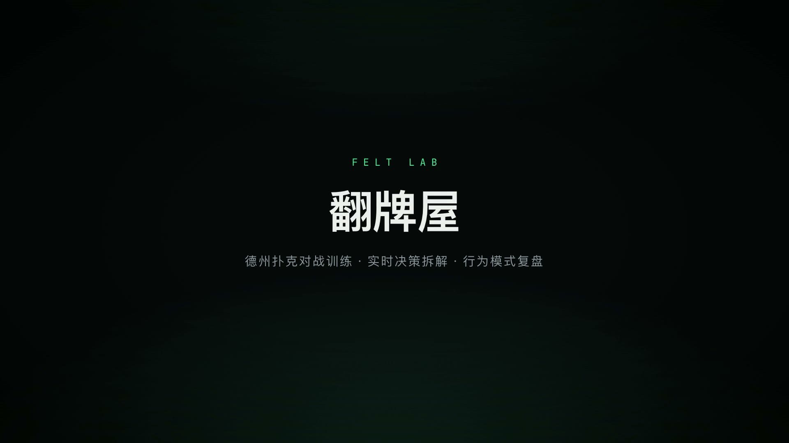

# 翻牌屋 FELT LAB

德州扑克对战训练网站: 和 GTO 近似策略或带性格偏移的策略对手实战, 每手实时拆解决策, 整局生成行为模式复盘。

**在线体验**: http://blockinsight.top/felt-lab/

[](https://github.com/tt-u/felt-lab/raw/main/public/promo.mp4)

(点击封面观看宣传片, 由 [HyperFrames](https://github.com/heygen-com/hyperframes) 渲染; 源文件在 `video/promo/`, `npm run gen:promo` 重渲染)

## 功能

- **牌桌**: 单挑 / 6 / 7 / 8 / 9 人桌, 现金桌规则(盲注 1/2), 完整支持加注规则、全下、边池、未跟注返还、平分底池
- **对手(GTO 近似基线 + 性格偏移)**:
  - 翻前: 标准 solver 衍生 RFI 范围表(UTG 14% 到 BTN 42%); 单挑独立范围(BTN 开 72%, BB 宽防守)
  - 翻后: 范围对范围引擎 — 重放公开行动推断每个玩家的 1326 组合实时范围,
    胜率对范围抽样, MDF 最小防守频率, 阻断牌选诈唬, 范围优势驱动下注频率
  - 六种性格档案: GTO 均衡 / 紧凶 TAG / 松凶 LAG / 紧弱 Nit / 跟注站 / 疯鱼 Maniac, 决策带频率随机化
  - 头像为 BitmapPunks 像素头像(@bitmappunks/avatar-generator 以名字为种子预生成)
- **风格可见性**: 开局选择"显示"(座位上标出风格, 练针对性调整)或"隐藏"(盲打读牌风, 复盘时揭晓)
- **兔子洞式实战复盘(本地实时, 零延迟)**:
  - 每手结束立刻呈现逐决策拆解: 对手下了多大(占池比例)、根据行动线他可能拿什么牌(范围引擎实时推断)、
    你的胜率 vs 所需胜率、教练建议 vs 你的实际选择
  - 弃牌后可开"兔子洞": 揭示剩余公共牌会怎么发、对手当时拿什么、你本来会赢还是弃得对
  - 行动条常驻牌力仪表: 当前成牌 + 对范围实时胜率
  - 全下摊牌时电视式实时胜率条, BAD BEAT / HERO CALL / 诈唬得手 高光横幅, 合成音效(可静音)
- **AI 即时点评**: 每手结束后 DeepSeek 教练结构化详评(判定+逐街分析)作为补充, 可展开(可关)
- **AI 复盘(结构化)**: 训练结束自动统计 VPIP / PFR / 3Bet / WTSD / 摊牌胜率 / 进攻频率,
  DeepSeek 以 JSON 模式输出评级卡 + 要点 + 关键手牌点评 + 漏洞清单 + 训练任务, 全部短句可扫读
- **手牌过程图表**: 复盘页每手牌以逐街时间线展示(牌面/行动流/底池增长条/注额比例条/摊牌结果),
  喂给 AI 教练的记录每街附有程序计算的成牌/板面性质标注(杜绝"四条被说成可能输给同花"这类牌力幻觉)
- 落地页氛围视频由 [HyperFrames](https://github.com/heygen-com/hyperframes) 离线渲染 (`npm run gen:hero`)

## 本地运行

```bash
npm install
cp .env.example .env.local   # 填入你的 DeepSeek API Key
npm run dev                  # 开发
npm run build && npm start   # 生产
```

`.env.local`:

```
DEEPSEEK_API_KEY=sk-xxxxxxxx
```

Key 只在服务端 API 路由 (`app/api/review/route.ts`) 中使用, 不会下发到浏览器。

## 氛围视频(可选)

落地页氛围视频源文件在 `video/hero/`, 修改后用 `npm run gen:hero` 重新渲染(需 ffmpeg)。

## 部署

两种形态:

- **GitHub Pages(静态, 本仓库已配置)**: push 到 main 自动构建部署(`.github/workflows/pages.yml`)。
  静态形态下没有服务端, DeepSeek 调用由浏览器直连, key 来自 Actions secret `DEEPSEEK_API_KEY`
  并在构建时注入前端包。**注意: 任何访客都能从前端代码中读到这个 key**, 仅适合个人演示;
  介意请改用下面的服务端形态并删除该 secret。
- **服务端形态(key 不出服务器)**: Vercel 导入仓库并设置环境变量 `DEEPSEEK_API_KEY`,
  或自托管 `npm run build && npm start`(建议 Nginx/Caddy 反代 + HTTPS)。

## 测试

```bash
npm run test:engine   # 引擎自检: 评牌器正确性 + 600+ 手模拟(边池/筹码守恒/零和校验)
npm run test:e2e      # 浏览器冒烟: 设置 -> 对战 -> AI 复盘全流程(需本机 Chrome 和已启动的服务)
npm run gen:ranking   # 重新生成翻前 169 手牌强度表(蒙特卡洛, 结果嵌入 lib/poker/ranges.ts)
```

## 架构

```
lib/poker/
  cards.ts        牌编码 / 洗牌(crypto 随机) / 手牌类别
  evaluator.ts    7 张牌评牌器(位运算, 返回可比较整数)
  equity.ts       对随机牌的蒙特卡洛胜率(离线排序生成用)
  ranges.ts       翻前 169 手牌强度排序 + 标准 RFI 图表 + 单挑范围 + 范围记号解析
  range-model.ts  范围对范围引擎(范围重放 / 对范围胜率 / MDF / 阻断牌 / 范围优势)
  personality.ts  六种对手性格档案
  ai.ts           机器人决策(翻前图表 + 翻后范围对范围 + 性格偏移 + 频率随机化)
  engine.ts       牌局状态机(下注轮 / 全下 / 边池 / 摊牌分池)
  history.ts      手牌记录 / 玩家统计 / 复盘文本生成
lib/store.ts      Zustand 会话状态(机器人调度 / 即时点评 / sessionStorage 持久化)
lib/review-prompt.ts  DeepSeek 结构化复盘提示词与解析
app/
  page.tsx          训练设置
  table/page.tsx    牌桌对战(含教练即时点评浮层)
  review/page.tsx   数据画像 + 结构化 AI 复盘 + 手牌过程图表
  api/review/route.ts  DeepSeek 代理(流式 SSE 转纯文本 / 非流式 / JSON 模式)
```

## 安全说明

- API Key 仅存于 `.env.local`(已被 .gitignore 忽略), 切勿提交到仓库或写进前端代码
- 如 Key 曾在聊天、截图等场景外泄, 请到 DeepSeek 控制台轮换
